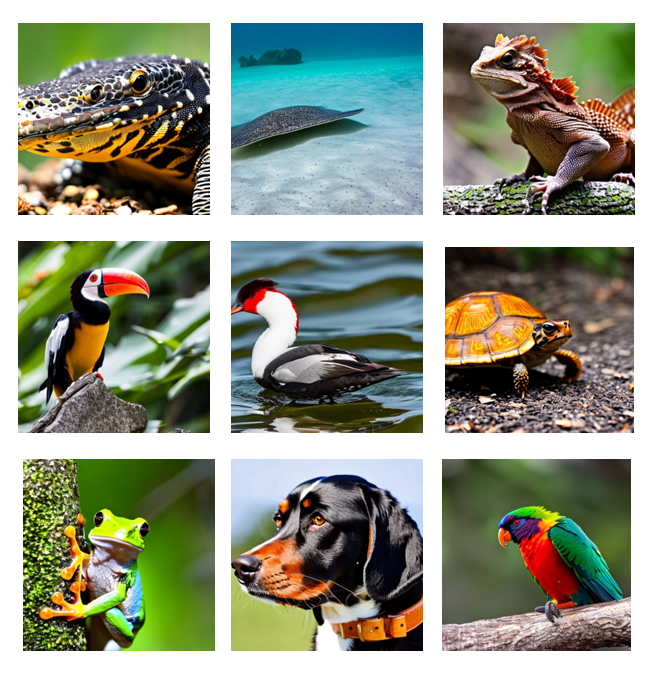

# RLDF

This is the repository that contains website for our paper :

[Reinforcement Learning from Diffusion Feedback](https://arxiv.org/pdf/x.pdf).

By Aboli Marathe

If you find our research useful for your work, please cite: 
```

```




For any queries, feedback or additional information you can contact the corresponding author at abolim[at]cs[dot]cmu[dot]edu.


Pre-print available at: .

 Website License : <a rel="license" href="http://creativecommons.org/licenses/by-sa/4.0/"></a><br />This work is licensed under a <a rel="license" href="http://creativecommons.org/licenses/by-sa/4.0/">Creative Commons Attribution-ShareAlike 4.0 International License</a>.
 This website was created using the template given in source code for the [Nerfies website](https://nerfies.github.io). <br> <br> <br>
